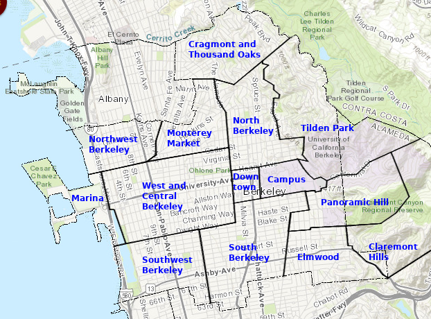

# Streets of Berkeley, CA

What are all in the streets in Berkeley? Where have I never been before?

## 1. Query for data

I went to [this site](https://www.melissa.com/v2/lookups/addresssearch/?number=&street=&city=Berkeley&state=CA&zip=&fmt=json&id=) to get all street names of Berkeley. I copied the results to `data.json`.

## 2. Parse out street names
```
jq '.[].StreetName' data.json  > streets.txt
```

## 3. Separate streets by area of Berkeley
```
cp streets.txt streets-modified.txt
```

Then, I divided Berkeley into sections, based on my experience living here. I grouped all streets into different areas of Berkeley:

```
> u=unknown
> ca=campus
> d=downtown
> ma=marina
> sw=southwest berkeley
> so=south berkeley
> p=panoramic hill
> e=elmwood
> ch=claremont hills
> w=west and central berkeley
> nw=northwest berkeley
> mm=monterey market
> cr=cragmont and thousand oaks
> no=north berkeley
> t=tilden park
```

If I want to update the grouping, I run `./refresh.sh` to fix the downstream files.

```
cat streets-modified.txt | cut -d '-' -f1 | grep -v '"' | sort | uniq -c  | sort -n
      3 ma
      6 u
     13 p
     15 d
     15 nw
     22 sw
     34 mm
     36 ch
     42 w
     47 e
     54 cr
     56 so
     58 no
     74 t
     76 ca
```

## 4. About each section of Berkeley




Original photo from [City of Berkeley's GIS Portal](https://www.cityofberkeley.info/maproom/). Edited with [GIMP](https://www.gimp.org/).

### Unknown

These were places I didn't recognize. I think they do not refer to streets. "Station" might refer to the Amtrak or BART stations. South Anx could be a building on campus. Oakland is a reference to Oakland, CA.

### Campus

Many places are building names on campus. As a college student, I visited most of this list.

A few names were new to me (like A E Bldg). I didn't know about the Animal Facility on campus (and [I'm not alone](https://talk.collegeconfidential.com/university-california-berkeley/1623981-northwest-animal-facility-the-most-secretive-building-at-cal.html))! The Richmond Field Station addresses are actually in Richmond, but UC Berkeley owns the property.

### Downtown

These streets make up the busiest sections of town. I lived here in 2018-19.

I didn't know that [MLK Jr Way used to be called Grove St](https://localwiki.org/oakland/Martin_Luther_King_Jr._Way). Harold Way is a tiny road near the Berkeley Public Library.

### Marina

These are the roads to [Adventure Playground](https://www.cityofberkeley.info/adventureplayground/), [César Chávez Park](https://www.cityofberkeley.info/ContentDisplay.aspx?id=56000), and the Berkeley Marina. When I was a child, my family took me to Adventure Playground on our trips to the Bay Area. As an adult, I have biked here many times. It makes me feel like I'm on the edge of the world.


### Southwest Berkeley

I think of my favorite park, the wide and grassy [San Pablo Park](https://www.cityofberkeley.info/Parks_Rec_Waterfront/Trees_Parks/Parks__San_Pablo_Park.aspx). I have shopped at Berkeley Bowl West several times, sometimes just for a handful of chocolate chips. [Missouri Lounge](https://www.missouriloungebar.com/) is a cool place to hang out: half biergarten and half dive bar. The [Tssui Fish House](https://www.berkeleyside.com/2015/11/30/how-quirky-is-berkeley-eugene-tssuis-fish-house-part-1) is nearby, and [Urban Ore](https://www.urbanore.com/) is a quirky warehouse full of secondhand items.

### South Berkeley

This is home to the old Lorin district. I lived here in 2019-20. 

I like [Sweet Adeline Bakeshop](http://sweetadelinebakeshop.com/). Sports Basement has an upright piano you can just go and play. I frequent a local [Thai temple's outdoor Sunday brunch](https://en.wikipedia.org/wiki/Wat_Mongkolratanaram). There's a [tool lending library](https://www.berkeleypubliclibrary.org/locations/tool-lending-library) and open basketball & tennis courts in the neighborhood. Ashby BART has a bazaar-style [flea market every weekend](http://www.berkeleyfleamarket.com/).

### Panoramic Hill

I lived in the nearby Clark Kerr dorm in 2013-14. My friends and I climbed this hill once to watch the sunrise. When I worked at the [Space Sciences Lab](https://vcresearch.berkeley.edu/research-unit/space-sciences-laboratory) in 2019, I often walked down the steep, beautiful fire trails on my way home.

### Elmwood

There are a lot of pretty roads in this area, like the tree-lined Alcatraz west of College Avenue. My favorite restaurant in Elmwood is [Nabolom Pizza and Bakery](https://www.nabolombakery.com/). The hills on the east side are challenging and rewarding.

### Claremont Hills

These roads are mostly residential, due east of the Claremont Hotel. The neighborhood is just below Grizzly Peak and the surrounding ridge, some of the highest points in Berkeley. 

Riding through here is difficult, but if you can make it up here, head to [Redwood Regional Park](https://www.ebparks.org/parks/redwood/) in Oakland. Some bikers bike to Grizzly Peak from the north side of Berkeley, and zoom through this neighborhood on their way down.

### West and Central Berkeley

These are the streets surrounding University Avenue. There are wonderful bike lanes and parks, like California St, the [Ohlone Greenway](https://www.cityofberkeley.info/Parks_Rec_Waterfront/Trees_Parks/PARKS__OHLONE_PARK(1).aspx), and the Aquatic Park.

[Vik's Chaat](http://vikschaat.com/) is a longtime (since childhood) favorite restaurant. I also like Milan for Indian groceries.

Fosters Freeze is a guilty pleasure of mine.

My friend worked at Mi Tierra Foods (grocery and prepared foods) in 2020; I'd visit him often. He'd buy burritos with an employee discount and we'd walk to Strawberry Creek Park or James Kenney Park to eat them.

I love the quiet and calm beauty of the small streets east of Sacramento St (Spaulding, Jefferson, Roosevelt, McKinley). 

### Northwest Berkeley

This area is close to Albany. Notable mentions in Albany: Happy Donuts on San Pablo and Ocean View Park.

I've been meaning to see a show at [924 Gilman](https://en.wikipedia.org/wiki/924_Gilman_Street) or [Ashkenaz](https://www.ashkenaz.com/). I peeked in 924 Gilman once; someone was covering [a SWMRS song](https://www.youtube.com/watch?v=hnPO3QzSbFo).

### Monterey Market

This is a cute and quiet area of town. There are rolling hills on the north side. I lived here in 2018. 

I like Cedar Rose Park. King Middle School's garden, track, and basketball courts are open to the public outside of school hours.

Of course, Monterey Market is a special Berkeley experience, preferably in the sunshine.

### Cragmont and Thousand Oaks

This is the northernmost part of Berkeley, close to Kensington. The Solano Avenue shopping area is nearby. Rumor has it [Billie Joe Armstrong](https://en.wikipedia.org/wiki/Billie_Joe_Armstrong) from Green Day lives here.

Indian Rock Park is a local favorite for watching the view on top of a giant boulder and rock climbing. The serene Great Stone Face Park is more isolated but much less crowded.

If you're biking to Grizzly Peak (or [taking the bus!](https://sfbaytransit.org/actransit/route/67/map)), you'll take Spruce St through this neighborhood. It's steep, but less so than most other roads around here.

Because of the elevation, the views are spectacular from almost anywhere in this neighborhood.

### North Berkeley

Close to campus, students find housing in homes, apartments, and [co-ops](https://www.bsc.coop/). [Cheese Board Pizza and Bakery](https://cheeseboardcollective.coop/) is a famous spot, often with live jazz. The original Peet's Coffee is in this neighborhood.

The parks are stunning: sit by the creek at Live Oak Park, go down the rock slide at Codornices, or get lost in the Rose Garden. I lived here in 2012-13 and again from 2014-16.

### Tilden Park

There are many small parks and winding roads in this neighborhood. This mostly residential area borders a jewel of Berkeley -- Tilden Park.

Once I'm on a trail, I feel like I'm in another world. There's Lake Anza. The train exhibit has a replica steam train you can ride; it's also fun to watch. 

Some of my favorite views are from the Lawrence Hall of Science, a children's museum. Once, I saw a raptor there; I think it was one of the [peregrine falcons that live on campus](https://calfalcons.berkeley.edu/).

## 5. Mark the roads I've traveled on (by section)

I'll skip the Unknown section.

There are only a few names in the Campus section that are roads in Berkeley (Bancroft Steps, Campus Dr, Lower Sproul Breezeway, Sports Ln). I have traveled on all of them.

I have been on every road in Downtown Berkeley and at the Marina.

But I haven't visited them all.

## 6. Explore new streets in Berkeley!

I'm keeping track of what I've definitely seen in `visited.txt`.

Which roads have I not yet explored? Use this command:
```
comm -13 <(cat visited.txt | sort) streets-sorted.txt 
```

---

*"The city, however, does not tell its past, but contains it like the lines of a hand, written in the corners of the streets, the gratings of the windows, the banisters of the steps, the antennae of the lightning roads, the poles of the flags, every segment marked in turn with scratches, indentations, scrolls."* - Italo Calvino, Invisible Cities
